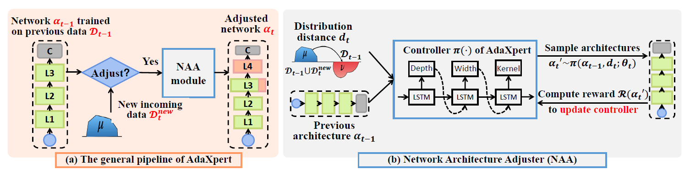
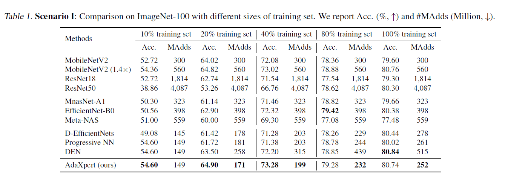
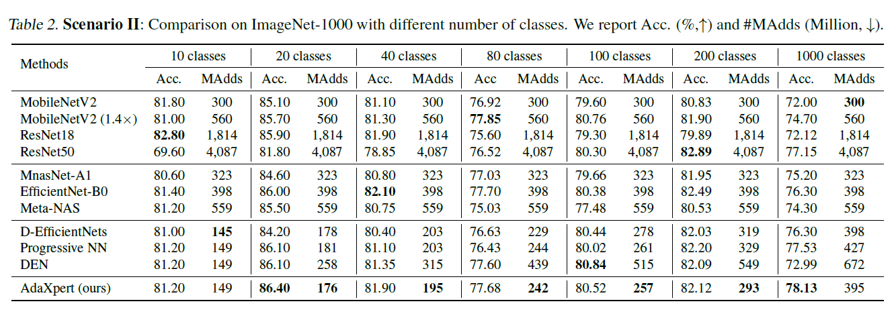

# AdaXpert: Adapting Neural Architecture for Growing Data

The PyTorch implementation of ICML 2021 paper "AdaXpert: Adapting Neural Architecture for Growing Data".

<p align="center">

</p>

The code will be coming soon.

## Requirements and Install
```
python >= 3.6, pytorch >= 1.3.0, torchvision>=0.4.0

pip install -r requirements.txt
```

## Training method (for supernet)
Train a supernet first, and then perform search based on the trained supernet. The training method of supernet follows SPOS [[paper](https://arxiv.org/pdf/1904.00420.pdf)].
```
CUDA_VISIBLE_DEVICES=0,1 horovodrun -np 2 -H localhost:2 python3 ctnas/train_spos_supernet.py
```
If only a single GPU is available:
```
CUDA_VISIBLE_DEVICES=0 horovodrun -np 1 -H localhost:1 python3 ctnas/train_spos_supernet.py
```

## Training method (for search)

Train in the Mobile block search space,
```
python3 ctnas/train_mb_spos.py --dataset_class_num 100 --dataset_ratio 1.0 --supernet_path "/path/to/trained-supernet"
```

## Evaluation method
Evaluate the adaxpert models.
Well-trained adaxpert models are available in folders "/models".
```
python3 ctnas/eval_mb_specnet.py --eval_model "adaxpert-100" --pretrained_submodel_path "/path/to/pre-trained model"
```

## Results on two data growing scenarios
The data volume is growing while the label space remains the same:
<p align="center">

</p>

The label space is growing:
<p align="center">

</p>

## Citation
If you use any part of our code in your research, please cite our paper:
```
@InProceedings{niu2021adaxpert,
  title = {AdaXpert: Adapting Neural Architecture for Growing Data},
  author = {Shuaicheng Niu and Jiaxiang Wu and Guanghui Xu and Yifan Zhang and Yong Guo and Peilin Zhao and Peng Wang and Mingkui Tan},
  booktitle = {The Internetional Conference on Machine Learning},
  year = {2021}
}
```

## Acknowledgment
The code is greatly inspired by the [OFA](https://github.com/mit-han-lab/once-for-all) and [SPOS](https://github.com/ShunLu91/Single-Path-One-Shot-NAS).
